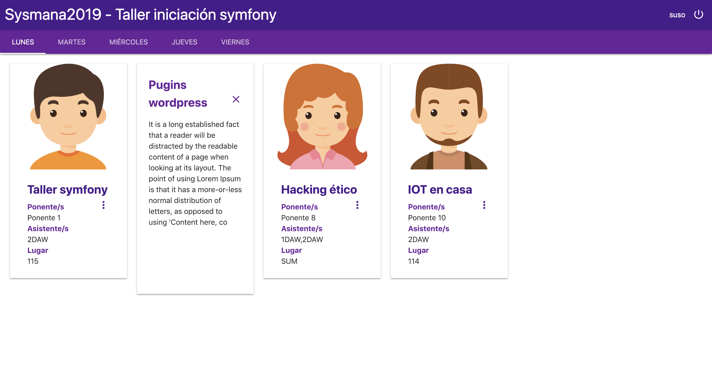

Taller iniciación symfony - Sysmana 2019
========================

Taller de introducción a **Symfony** con buenas prácticas. Se hará un ejercicio práctico donde se pondrá en práctica la parte **teórica** del taller.

:exclamation: Requisitos :exclamation:
--------------

  * **Ordenador**.

  * **Conexión internet**.

  * **IDE o editor de código preparado para PHP**, recomendable IDE PhpStorm.

  * **Xampp o similar instalado, versión de php recomendada 7.2**, descargar xampp desde [aquí](https://www.apachefriends.org/es/download.html).

  * **Composer**, puedes instalarlo desde 
  [aquí](https://getcomposer.org/download/)

:boom: Demo :boom:
--------------

Se realizará un **pequeño ejercicio práctico** en que se reproducirá una web parecida a la mostrada a continuación. Esta web **realizará una consulta a una base de datos**, la cuál contiene toda la información a mostrar. **Está información se visualizará filtrada por días**. De tal manera que podremos ver las **charlas de cada día y la información sobre ellas**.

:bust_in_silhouette: Ponentes :bust_in_silhouette:
--------------

**Miguel Gavilán Merino y Jesús Mejías Leiva**

